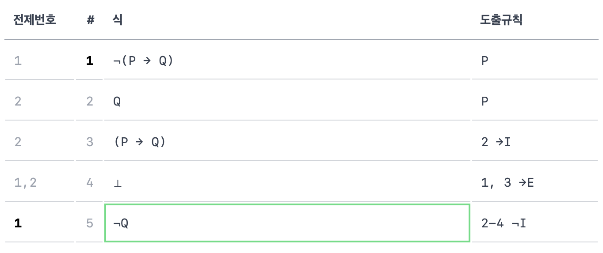

# 1차논리 검증기

<https://logic-validator.jangjunha.me>



형식언어 ℒ과 Gentzen의 추론 규칙에 따른 논증이 타당한지 실시간으로 검증하는 기능을 가진 웹페이지입니다.

고려대학교 〈기호논리학〉 수업과 〈계산이론〉, 〈프로그래밍언어〉 수업을 듣고 개인적으로 실습해보면서 만든 사이트입니다. 교재 [〈기호논리학〉][elementary-logic-book](Benson Mates, 김영정·선우환 역, 문예출판사, 1995)의 형식언어 ℒ과 수업에서 다룬 Gentzen의 추론 규칙을 바탕으로 합니다. 더 자세한 설명은 [도움말 페이지][help]를 확인하세요.

파서와 검증기, 웹사이트 모두 Rust로 작성되었습니다. 파서는 [nom]을, 웹사이트는 [yew]를 이용했습니다.

## Requirements

- [Rust](https://www.rust-lang.org/tools/install)

- [Install WASM Target](https://yew.rs/docs/getting-started/introduction#install-webassembly-target)

  ```sh
  rustup target add wasm32-unknown-unknown
  ```

- [Install Trunk](https://yew.rs/docs/getting-started/introduction#install-trunk)

  ```sh
  cargo install --locked trunk
  ```

## Run development server

```zsh
$ trunk serve
```

## Run test

```zsh
$ cargo test
```

[elementary-logic-book]: https://product.kyobobook.co.kr/detail/S000000548655
[help]: https://logic-validator.jangjunha.me/help/
[nom]: https://github.com/Geal/nom
[yew]: https://github.com/yewstack/yew
